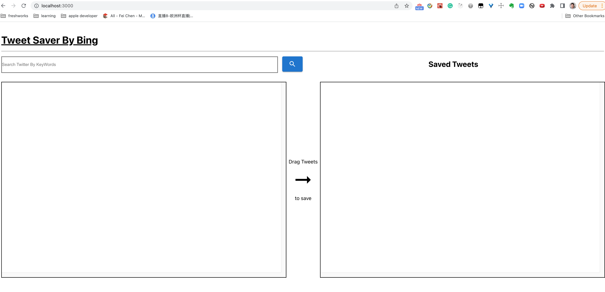
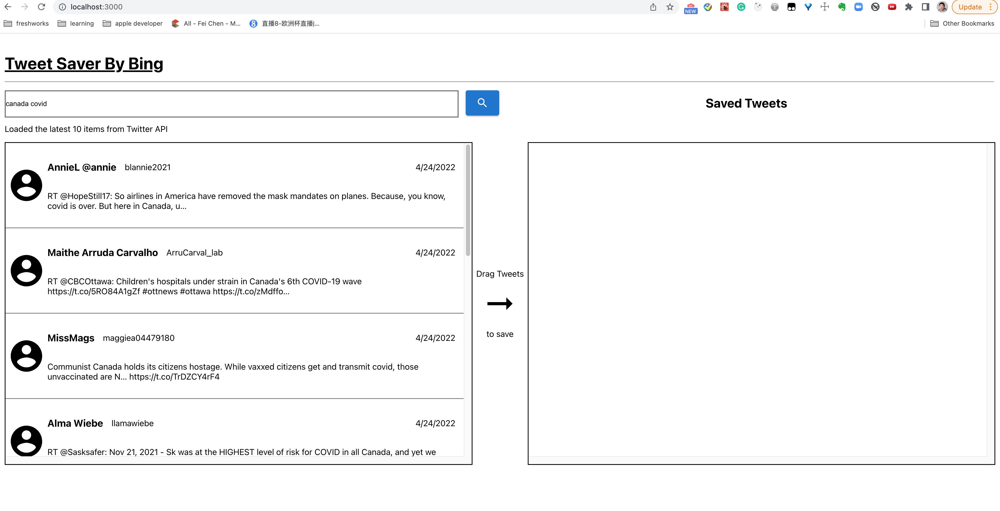
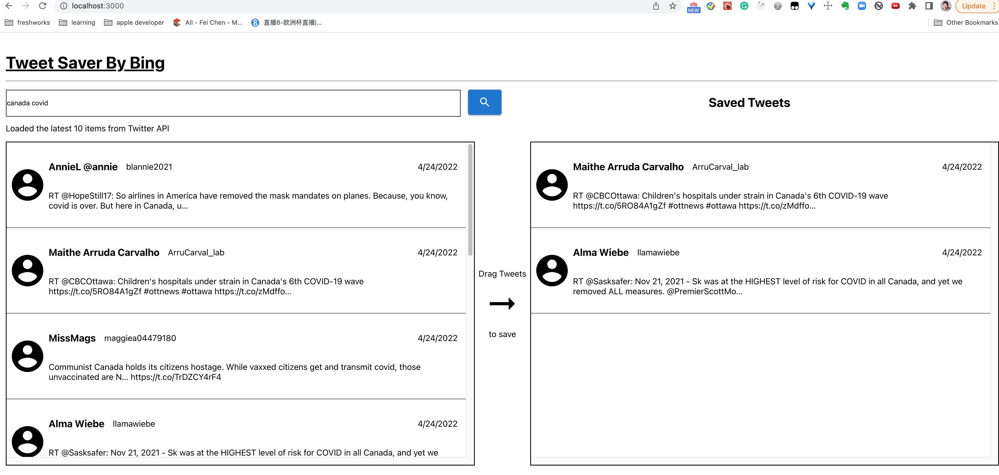

# Getting Started with Create React App

This project was bootstrapped with [Create React App](https://github.com/facebook/create-react-app).

## Available Scripts

In the project directory, you can run:

### `npm start`

Runs the app in the development mode.\
Open [http://localhost:3000](http://localhost:3000) to view it in the browser.

The page will reload if you make edits.\
You will also see any lint errors in the console.

### `npm test`

Launches the test runner in the interactive watch mode.\
See the section about [running tests](https://facebook.github.io/create-react-app/docs/running-tests) for more information.

### `npm run build`

Builds the app for production to the `build` folder.\
It correctly bundles React in production mode and optimizes the build for the best performance.

The build is minified and the filenames include the hashes.\
Your app is ready to be deployed!

See the section about [deployment](https://facebook.github.io/create-react-app/docs/deployment) for more information.

### `npm run eject`

**Note: this is a one-way operation. Once you `eject`, you can’t go back!**

If you aren’t satisfied with the build tool and configuration choices, you can `eject` at any time. This command will remove the single build dependency from your project.

Instead, it will copy all the configuration files and the transitive dependencies (webpack, Babel, ESLint, etc) right into your project so you have full control over them. All of the commands except `eject` will still work, but they will point to the copied scripts so you can tweak them. At this point you’re on your own.

You don’t have to ever use `eject`. The curated feature set is suitable for small and middle deployments, and you shouldn’t feel obligated to use this feature. However we understand that this tool wouldn’t be useful if you couldn’t customize it when you are ready for it.

## SaveTweet Detail

### deploy to aws lightsail
It uses lightsail container service.

It can be access through this [here](https://container-service-2.f4peb530dmhr8.us-west-2.cs.amazonlightsail.com/)

## Running it in local
### Preparation
 First download the source code in your machine.
 in root folder create a .env file and put the correspond secrets value for twitter service
 ```env
 REACT_APP_CONSUMER_KEY=
REACT_APP_CONSUMER_TOKEN=
REACT_APP_ACCESS_TOKEN=
REACT_APP_ACCESS_TOKEN_SECRET=
 ```
then run `npm install` to install dependencies.

 the third step is run `node server.js` to start a local server to bypass cors issue.

 ## Start react app

 run `npm start` in the terminal window

 ## unit test
There is no unit test for this simple project

 ## integration test
The cypress library used to do integration test.
The integration test not done for all functions.
the test file under cypress folder
## Final Result
Please see the my local version of the app
open the app home page



Type some key word(please note I disable the input event, only user click the button will trigger api call)


After user drag item to right. (TODO: the dragged item need to removed from left side)
## the library react-dnd does not support multiple items drag and drop. Please see this github [issue](https://github.com/react-dnd/react-dnd/issues/14)



## Dockerize the application
This application also can be run through docker and docker-compose

Install the docker and docker-compose first and run `docker-compose build` to build docker images
then run `docker-compose up` to start the app, and open localhost:3000 in browser can open the app
at the end run `docker-compose stop` to shutdown the app.